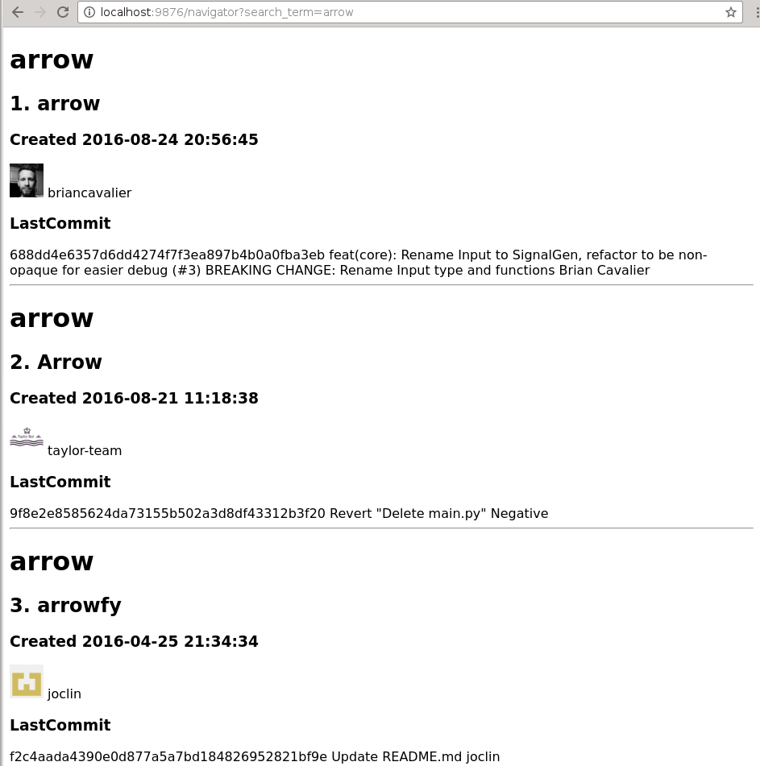

GitHub Navigator
================



A web application to search latest repositories by created time on GitHub.

No more than 5 results for each search.

This app uses Python Web Framework: Tornado

Preparation
------------
```
pip install -r dependencies
```


Run it
------------
```
python application.py
```

View it
-------------
In your browser, open page, e.g. http://localhost:9876/navigator?search_term=arrow

> Notice: Assume that **arrow** is the keyword which you want to search

Study it
-------------
Have a look at folder `.test`

